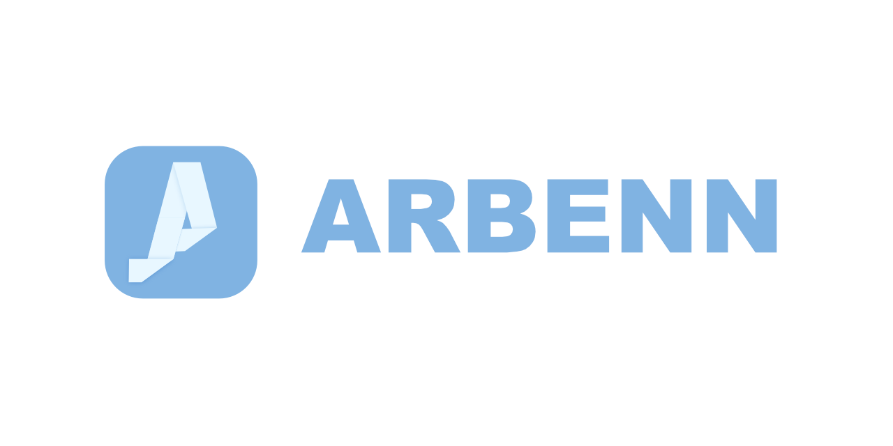
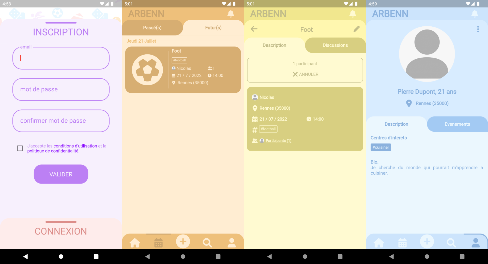

# TODOS

- [ ] Switch from firebase to locally running backend
  - [ ] Use mongodb instead of firestore
  - [ ] Find a replacement solution for authentification
  - [ ] Use s3 like api for storage

- [ ] Provide support for other languages (currently, the app is available in French only)

# Build

For now, the build is not possible locally unless you create a [firebase](https://firebase.google.com) project and add your [credentials](https://firebase.flutter.dev/docs/manual-installation). We plan in the future to use mangodb and s3 like storage to get rid of firebase.

We use typesense as a research engine, you need to run a local server. Use the script `typesense/create_collection.sh` to create a collection and `run_local.sh` to run it. This step needs `docker` to run correctly.

Then, you can use [flutter](https://docs.flutter.dev/get-started/install) to build and test the app on the device of your choice.

# The app

With Arbenn, anyone can create or attend to events with people they may have never met but who share a common passion.

Imagine, its friday and you don't know what to do of your weekend. You could either propose to go running with someone, go to the cinema with someone who shares your taste for old movies, or even share a drink with people that live nearby, but whom you've never met before.

The app is articulated arround 4 screens: 

- Home: Events arround you that corresponds to your tastes
- Calendar: Your future and past events
- Search: Well...
- Profile: You personal information (city, interests and name) and the list of events you created

The apps aims to be easy to use with few buttons.

